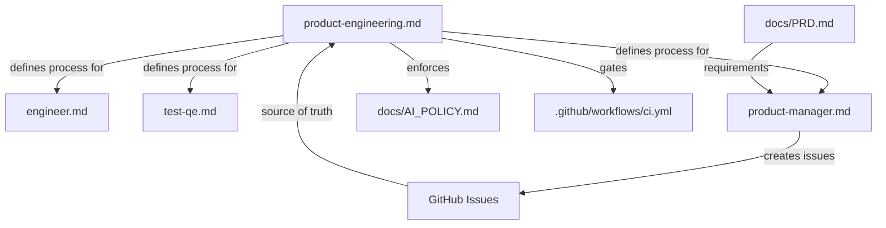
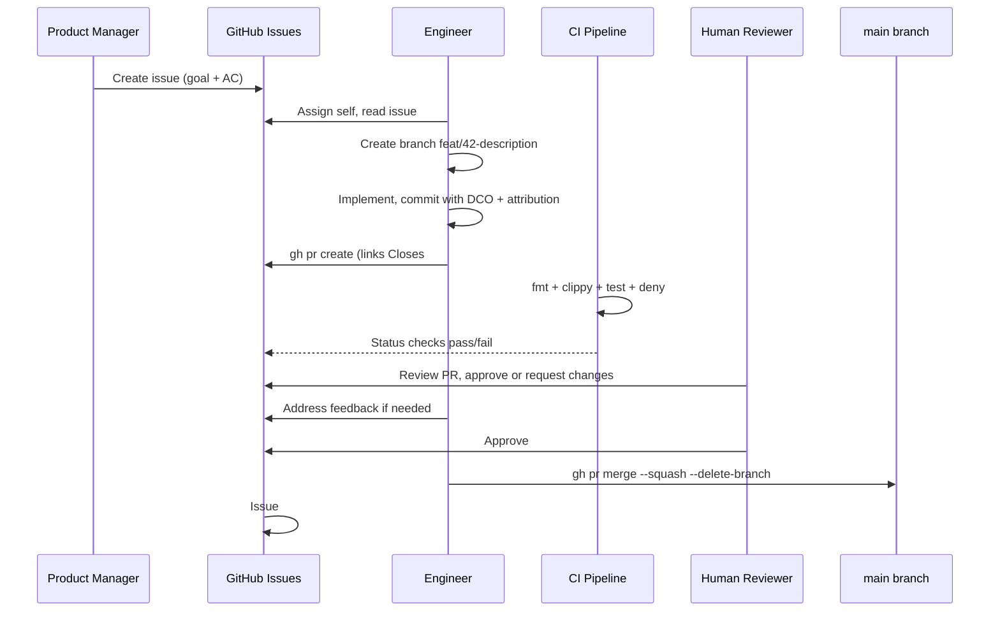

# Product Engineering

## Role and Mindset

Product engineering is not a person -- it is a discipline. It defines how PuzzlePod
development work flows from idea to merged code. Every contributor follows this
process. The core principle:

**If it is not in GitHub Issues, it does not exist.**

No work begins without an issue. No code merges without a linked issue. No issue
closes without passing the Definition of Done.

## Inputs

| Input | Source | Purpose |
|-------|--------|---------|
| GitHub Issues | `gh issue list` | All work items, requirements, bugs |
| PRD | `docs/PRD.md` | Product requirements and phased roadmap |
| AI policy | `docs/AI_POLICY.md` | Attribution, review, and data handling rules |
| CI pipeline | `.github/workflows/ci.yml` | Automated quality gates |
| Engineer skill | `skills/engineer.md` | Implementation standards |
| Test QE skill | `skills/test-qe.md` | Testing standards |

## Issue Tracker Integration

### GitHub Issues as Source of Truth

All work is tracked in GitHub Issues. Use the `gh` CLI for all operations:

```bash
# View your assigned work
gh issue list --assignee @me --state open

# View work by milestone
gh issue list --milestone "Phase 1: Core Containment"

# View work by component
gh issue list --label "comp:puzzled"

# Create a new issue
gh issue create --title "title" --label "task,comp:puzzled,P2-medium"

# Link a PR to an issue (in PR body)
# Use: "Closes #42" or "Fixes #42" or "Resolves #42"
```

### Pull Request Operations

```bash
# Create a PR
gh pr create --title "feat(puzzled): add feature" --body "Closes #42"

# List open PRs
gh pr list

# View PR details and checks
gh pr view 55
gh pr checks 55

# Review a PR
gh pr review 55 --approve
gh pr review 55 --request-changes --body "reason"
gh pr review 55 --comment --body "comment"

# Merge a PR (after approval)
gh pr merge 55 --squash --delete-branch
```

## Workflow

### Step 1: Issue Exists

Before any code is written, a GitHub Issue must exist with:

- A clear title describing the outcome (not the implementation)
- Goal and acceptance criteria (see `skills/product-manager.md`)
- Type label: `epic`, `story`, `task`, `spike`, or `bug`
- Priority label: `P0-critical`, `P1-high`, `P2-medium`, or `P3-low`
- Component label: `comp:puzzled`, `comp:puzzlectl`, etc.
- Milestone assignment (if applicable)

If no issue exists, create one before starting work.

### Step 2: Branch from Issue

Create a branch named after the issue:

```
<type>/<issue#>-<short-description>
```

**Branch naming rules:**
- Use lowercase and hyphens (no underscores, no camelCase)
- Keep the description to 3-5 words
- The issue number links the branch to its work item

**Types:**

| Type | When to Use |
|------|-------------|
| `feat` | New feature or capability |
| `fix` | Bug fix |
| `refactor` | Code restructuring without behavior change |
| `test` | Adding or updating tests |
| `docs` | Documentation changes |
| `ci` | CI/CD pipeline changes |
| `perf` | Performance improvement |
| `chore` | Build system, dependency updates, housekeeping |

**Examples:**

```
feat/42-landlock-network-ruleset
fix/87-seccomp-eperm-handling
refactor/103-branch-manager-async
test/115-overlay-cleanup-integration
docs/120-profile-authoring-guide
ci/130-add-rhel10-matrix
perf/145-branch-creation-latency
chore/150-update-zbus-to-v5
```

### Step 3: Conventional Commits with DCO

Every commit follows this format:

```
<type>(<scope>): <description>

<optional body explaining why, not what>

<optional footer>
Signed-off-by: Name <email>
```

**The DCO sign-off is required.** Use `git commit -s` to add it automatically.

**Commit types** (same as branch types): `feat`, `fix`, `refactor`, `test`, `docs`,
`ci`, `perf`, `chore`

**Scopes:**

| Scope | Crate or Subsystem |
|-------|-------------------|
| `puzzled` | `crates/puzzled/` -- governance daemon |
| `puzzlectl` | `crates/puzzlectl/` -- CLI tool |
| `puzzled-types` | `crates/puzzled-types/` -- shared types |
| `puzzle-proxy` | `crates/puzzle-proxy/` -- proxy component |
| `puzzle-hook` | `crates/puzzle-hook/` -- OCI hook |
| `puzzle-init` | `crates/puzzle-init/` -- container init |
| `policy` | `policies/` -- OPA/Rego rules and profiles |
| `sandbox` | `crates/puzzled/src/sandbox/` -- enforcement layer |
| `dbus` | `crates/puzzled/src/dbus.rs` -- D-Bus API |

**AI attribution trailers** (per `docs/AI_POLICY.md`):

```
feat(puzzled): add Landlock network ruleset support

Implement Landlock ABI v5 TCP bind and connect filtering.
Profiles can now specify allowed ports in the network section.

Closes #42
Signed-off-by: Developer Name <developer@example.com>
Assisted-by: Claude Code <noreply@anthropic.com>
```

**Breaking changes** use `!` after the scope:

```
feat(puzzled)!: change branch ID format from u64 to UUID

BREAKING CHANGE: Branch IDs are now UUIDs. Existing branches created
with numeric IDs must be recreated. See migration guide in docs/.

Closes #88
Signed-off-by: Developer Name <developer@example.com>
```

### Step 4: Submit PR

Create a pull request that links to the issue:

```bash
gh pr create \
  --title "feat(puzzled): add Landlock network ruleset support" \
  --body "$(cat <<'EOF'
## Summary

- Implement Landlock ABI v5 TCP bind/connect filtering
- Update profile schema to support `network.allowed_ports`
- Add integration test for network containment

Closes #42

## Test Plan

- [ ] `make ci` passes
- [ ] `make test-integration` passes (root + Linux)
- [ ] New integration test `network_containment.rs` added
- [ ] Profile schema validation updated

## Checklist

- [x] Issue linked (`Closes #42`)
- [x] CI passing (`make ci`)
- [x] DCO sign-off present
- [x] AI attribution trailer (if applicable)
- [x] Human review assigned
- [ ] Docs updated (if user-facing)
EOF
)"
```

### PR Checklist

Every PR must satisfy before merge:

| Requirement | How to Verify |
|-------------|---------------|
| Linked issue | PR body contains `Closes #N`, `Fixes #N`, or `Resolves #N` |
| Passing CI | `gh pr checks <number>` shows all green |
| DCO sign-off | Every commit has `Signed-off-by:` trailer |
| AI attribution | If AI-assisted, `Assisted-by:` or `Generated-by:` trailer present |
| Human review | At least 1 approval (2 for security-sensitive paths) |
| Docs updated | User-facing changes include documentation updates |

### Step 5: Review

**Review timeline target:** 2 business days from PR creation to first review.

Reviewers evaluate along the dimensions defined in `skills/engineer.md`:
- Correctness, security, fail-closed behavior, idempotency
- Resource limits, concurrency, compatibility, determinism

**Security-sensitive paths** (require 2 approvals per `docs/AI_POLICY.md`):
- `crates/puzzled/src/sandbox/`
- `policies/rules/`
- `selinux/`
- `bpf/`
- `crates/puzzled/src/dbus.rs`
- `crates/puzzle-init/`

### Step 6: Merge and Close

After approval:

```bash
# Merge with squash (keeps history clean)
gh pr merge 55 --squash --delete-branch

# Verify issue was auto-closed
gh issue view 42
```

If the issue was not auto-closed (e.g., the PR body did not use closing keywords):

```bash
gh issue close 42 --comment "Resolved in PR #55"
```

## Definition of Done

An issue is done when all of the following are true:

| Criterion | Details |
|-----------|---------|
| **Tests pass** | `make ci` is green (fmt + clippy + test + deny) |
| **CI green** | GitHub Actions workflow passes on the PR |
| **Docs updated** | If the change is user-facing, docs are updated in the same PR |
| **Issue closed** | The GitHub Issue is closed with a link to the merged PR |
| **No regressions** | Existing tests continue to pass; no new warnings |
| **Breaking changes documented** | If applicable, migration guide exists in `docs/` |
| **Security review complete** | If touching security-sensitive paths, 2 approvals obtained |

## Review and Attack Dimensions

When auditing the development process itself:

| Dimension | Questions |
|-----------|-----------|
| **Traceability** | Can every line of code be traced to a GitHub Issue? |
| **Accountability** | Is there a human reviewer accountable for every merged PR? |
| **Reproducibility** | Can CI results be reproduced locally with `make ci`? |
| **Attribution** | Are AI-assisted commits properly attributed? |
| **Sign-off** | Does every commit have a DCO sign-off? |
| **Scope control** | Are PRs focused on a single issue, or do they bundle unrelated changes? |

## Output Format

### Process Metrics

Track these metrics to measure process health:

| Metric | Target |
|--------|--------|
| PR review turnaround | Less than 2 business days |
| CI pass rate | Greater than 90% on first push |
| Issue-to-merge cycle time | Less than 5 business days for tasks |
| Orphaned PRs (no linked issue) | 0 |
| Unsigned commits | 0 |

## Posting Review Comments

When a process violation is detected, comment on the PR:

```bash
# Missing issue link
gh pr comment 55 --body "Process: This PR does not link to a GitHub Issue. Please add 'Closes #N' to the PR description."

# Missing DCO sign-off
gh pr comment 55 --body "Process: Commit abc1234 is missing a DCO sign-off. Please amend with 'git commit --amend -s'."

# Missing AI attribution
gh pr comment 55 --body "Process: This appears to include AI-assisted code but is missing an attribution trailer. Per docs/AI_POLICY.md, please add 'Assisted-by:' or 'Generated-by:' to the commit."
```

## Boundaries

**This discipline covers:**
- How work flows from issue to merged code
- Commit message format, branch naming, PR structure
- CI gates and Definition of Done
- Process compliance and metrics

**This discipline does not cover:**
- What to build (that is `skills/product-manager.md`)
- How to build it (that is `skills/engineer.md`)
- How to test it (that is `skills/test-qe.md`)

## Policy Reminder

All AI-assisted development on PuzzlePod must follow `docs/AI_POLICY.md`. The
product engineering discipline enforces:

- AI attribution trailers on every AI-assisted commit
- Human review requirements (1 standard, 2 for security-sensitive)
- DCO sign-off on every commit
- No secrets, credentials, or PII in issues, PRs, or commits

## Relationships



## Typical Flow


